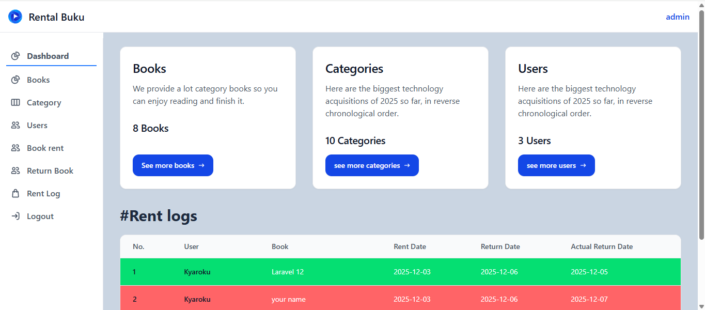
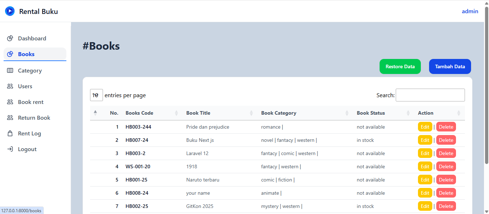
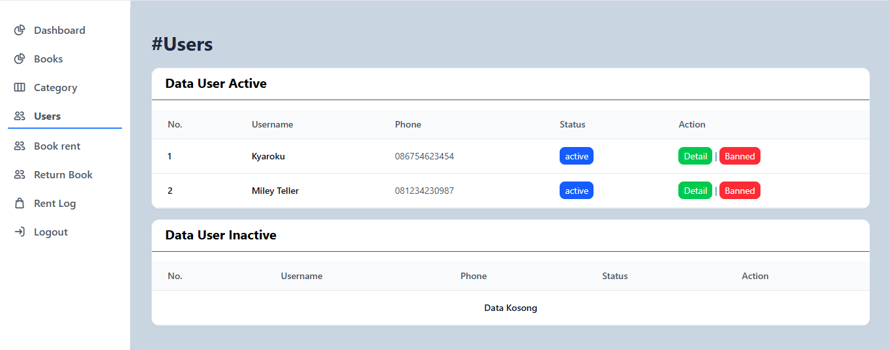
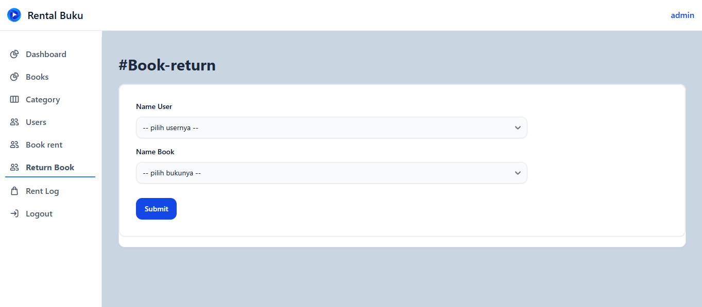
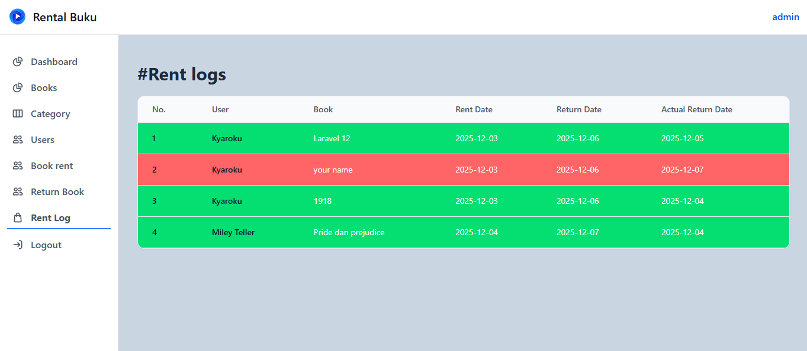
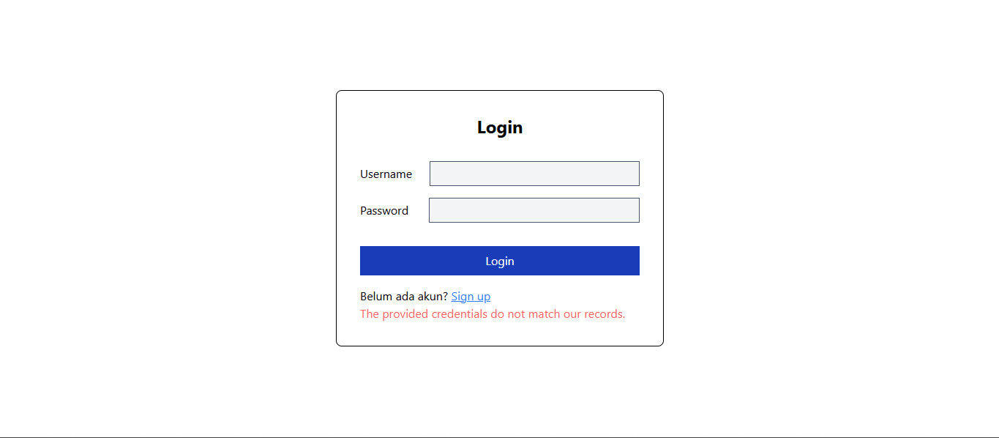
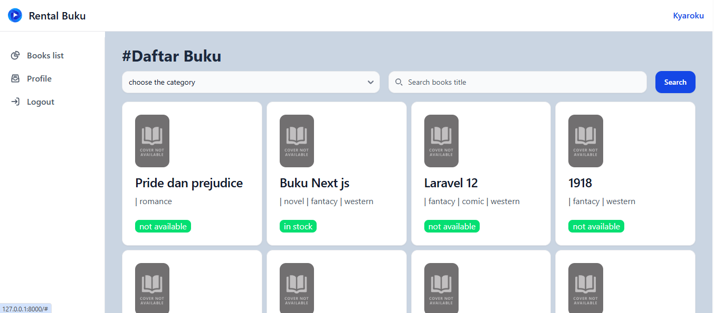

# PROJECT-BOOK-RENT

Empowering Book Lovers, Simplifying Library Management

---

## Overview

project-book-rent adalah aplikasi web berbasis Laravel yang dirancang untuk mempermudah manajemen perpustakaan dan proses peminjaman buku.
Proyek ini menggabungkan arsitektur modular dengan role-based access control untuk memastikan operasi yang aman dan efisien bagi admin maupun pengguna.

Aplikasi ini menggunakan Tailwind CSS dan Vite sebagai frontend modern, serta backend yang kuat untuk mendukung pengelolaan peminjaman, pengembalian, data buku, dan profil pengguna.

---

## Why project-book-rent?

Proyek ini menyederhanakan kompleksitas alur kerja perpustakaan melalui fitur-fitur berikut:

### ✨ Modular MVC Architecture  
Pemisahan yang jelas antara models, views, dan controllers untuk meningkatkan maintainability dan skalabilitas aplikasi.

### 🔐 Role‑Based Access Control  
Route dan permission yang aman bagi admin serta pengguna umum.

### 📚 Rental & Return Management  
Mengelola peminjaman buku, pengembalian, dan riwayat dengan efisien.

### 🎨 Frontend Integration  
UI modern menggunakan Tailwind CSS, komponen Blade, dan manajemen aset berbasis Vite.

### ⚙️ Configurable & Scalable  
Setup komprehensif yang mendukung konfigurasi berdasarkan environment serta ekstensi tambahan.

---

## Built With

- JSON  
- Markdown  
- NPM  
- Composer  
- JavaScript  
- XML  
- PHP  
- Vite  
- Axios  

---

## Installation

Follow these steps to install and run the project locally:

### 1. Clone Repository
```bash
git clone https://github.com/Annisarh/project-book-rent
```

### 2. Install Dependencies
```bash
composer install
npm install
```

### 3. Setup Environment
```bash
cp .env.example .env
php artisan key:generate
```

Update your database credentials in the `.env` file.

### 4. Run Migrations
```bash
php artisan migrate --seed
```

### 5. Start Development Servers
```bash
php artisan serve
npm run dev
```

Now open:  
**http://127.0.0.1:8000**

---

## License
This project is open‑source and available under the MIT License.


## Screenshots









